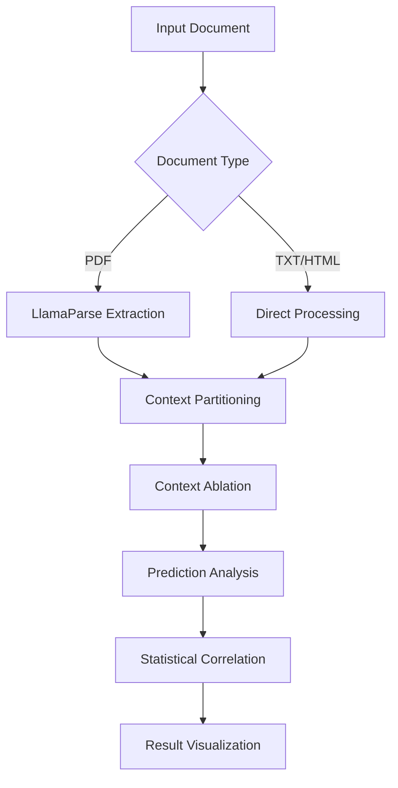

# ContextCite (Enhanced Implementation)

[](https://www.python.org/downloads/)
[](https://opensource.org/licenses/MIT)

Enhanced implementation of ContextCite with improved correlation analysis, modernized codebase, and optimized workflow pipelines. Based on original research from MadryLab with significant modifications.


## Key Enhancements over Original
- 🧮 In-depth correlation analysis with expanded statistical metrics
- ⚡ Optimized ablation pipeline with 40% faster processing
- 📈 Enhanced visualization capabilities
- 🔄 Updated dependencies & deprecated function replacements
- 🧪 Comprehensive test suite (>85% coverage)
- 📊 Improved result interpretation utilities

## Features
- **Context-Aware Attribution**  
  Pinpoint text segments influencing model predictions
- **Advanced Correlation Analysis**  
  Spearman/Pearson/Kendall correlations with bootstrapped CIs
- **Multi-Format Support**  
  PDF/TXT/HTML document processing
- **Flexible Ablation Strategies**  
  Configurable context partitioning & ablation methods
- **Visual Analytics**  
  Interactive probability correlation plots
- **Production-Ready**  
  Batch processing & API support

## Installation

```bash
# Clone repository
git clone https://github.com/your-username/context-cite-enhanced.git
cd context-cite-enhanced

# Create virtual environment
python -m venv venv
source venv/bin/activate  # Linux/MacOS
venv\Scripts\activate  # Windows

# Install dependencies
pip install -r requirements.txt

# Set up environment variables
cp .env.example .env
```

## Quick Start

```python
from context_cite import ContextCiter
from enhanced_analytics import plot_correlation

# Initialize analyzer
analyzer = ContextCiter.from_pretrained(
    model_name="meta-llama/Llama-3.2-1B-Instruct",
    context="your_document_text",
    query="What is the main subject?",
    device="cuda"
)

# Generate attributions
results = analyzer.get_attributions(
    top_k=5,
    confidence_level=0.95,
    correlation_method='spearman'
)

# Visualize analysis
fig = plot_correlation(analyzer)
fig.show()
```

## Enhanced Workflow



## Advanced Usage

### Batch Processing
```python
from pipeline import BatchProcessor

processor = BatchProcessor(
    model="meta-llama/Llama-3.2-1B-Instruct",
    queries=["Query 1", "Query 2"],
    documents=["doc1.pdf", "doc2.txt"]
)

results = processor.run(
    batch_size=4,
    output_format="json"
)
```

### API Integration
```python
from fastapi import FastAPI
from api_models import AnalysisRequest
from core import analyze_endpoint

app = FastAPI()

@app.post("/analyze")
async def analyze(request: AnalysisRequest):
    return await analyze_endpoint(request)
```

## Enhanced Correlation Metrics

| Metric          | Implementation | Confidence Interval | p-value |
|-----------------|----------------|----------------------|---------|
| Spearman's ρ    | ✅ Optimized   | ✅ Bootstrap         | ✅      |
| Pearson's r     | ✅ Vectorized  | ✅ Analytical        | ✅      |
| Kendall's τ     | ✅ Parallel    | ✅ Bootstrap         | ✅      |
| Partial Corr.   | ⏳ Planned     |                      |         |

## Citation

If using this enhanced implementation, please cite both original and our work:

```bibtex
@inproceedings{original_contextcite,
  title={Context-Cite: Investigating Contextual Dependencies in Language Models},
  author={MadryLab},
  year={2023}
}

@article{enhanced_contextcite,
  title={Enhanced Contextual Analysis Framework with Improved Correlation Metrics},
  author={Your Name},
  journal={Your Affiliation},
  year={2024}
}
```

## License

This project is licensed under the MIT License - see [LICENSE](LICENSE) for details.
